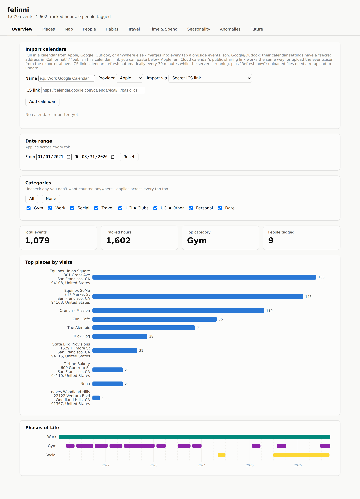
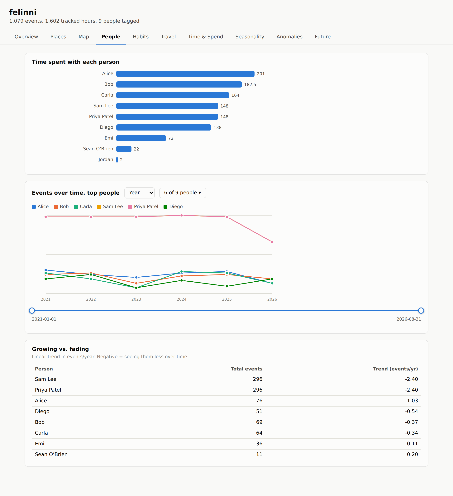
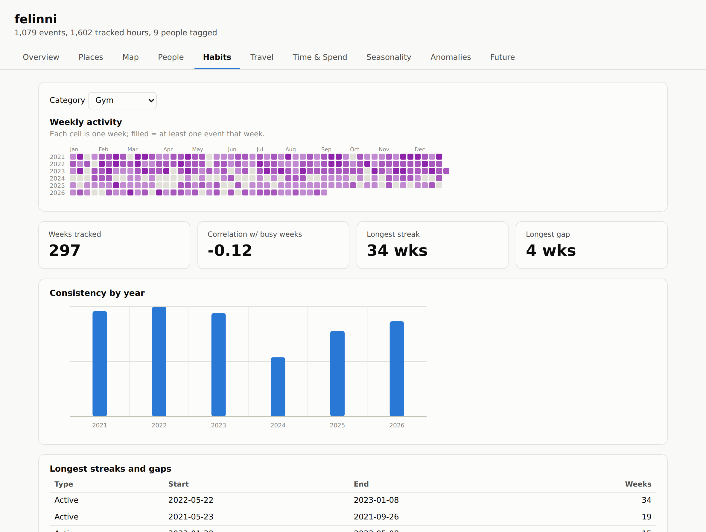

# felinni

Retroactively mine your own Apple Calendar for patterns: where you've been,
who you've spent time with, habit consistency, travel history, and
anomalous weeks.



## Quickstart

**1. Export your calendar (on a Mac — EventKit is macOS/iOS-only):**

```bash
cd CalendarExporter
swift run CalendarExporter --start 2015-01-01 --end 2026-09-16 --output ../events.json
```

First run prompts for Calendar access. `--calendars "Gym,Social,Dating"` limits
to specific calendars. Nothing here calls out to a server — `events.json`
never leaves your machine.

**2. Browse the dashboard (works anywhere):**

```bash
cd analysis
pip install -r requirements.txt
python webapp/server.py --events ../events.json
```

Open **http://127.0.0.1:5000**. No real export yet? Try it against the
committed synthetic fixture: `python webapp/server.py --events ../data/sample_events.json`.

## Tagging conventions

The toolkit works with whatever you have, but a bit of structure goes a long way:

| What | How |
|---|---|
| **Category** | A dedicated Calendar per category, or a `Category: Gym` note line (wins if both present) |
| **People** | Attendees, a `People: Alice, Bob` note line, or a trailing "Dinner with John Doe, Jane Doe" in the title |
| **Location** | The Location field, or a `Location: <place>` note line. Meeting links/phone numbers are auto-filtered out |
| **Travel** | Category "Travel"/"Trip"/"Flight"/"Vacation", or "Flight to...", "Trip to..." in the title |
| **Dating** | Category "Date" + the person tagged, to enable `felinni.dating_link` |

Messier/older events (no location, no people) are handled too — they just
don't contribute to analyses that need that field.

## What's in the dashboard

Tabs: **Overview · Places · People · Habits · Travel · Future · Anomalies**. Every
table is sortable (click a header).
The Overview tab's date range and category checkboxes apply globally; each
tab's own filters stack on top.



- **People** — one table per person consolidating time spent (a mini
  bar), time since you last saw them (a ring that fills and shifts from
  green to red the longer it's been), known since (a mini bar off their
  earliest event, e.g. "8mo" or "2.3yr"), and growing/fading (a small
  diverging bar, green/right for more often, red/left for less), plus an
  "events over time" chart with a dropdown for who to plot and a
  draggable range slider to zoom into a sub-range. All-day events are
  excluded everywhere hours are counted, so a full-day placeholder
  doesn't inflate anyone's total. A friend network graph plots everyone
  as a node, linked to whoever they've shared a real, timed event with
  (thicker link = more shared events, draggable to rearrange), scroll/pinch
  to zoom and drag the background to pan. Node color is switchable via a
  dropdown between time since last seen, known since, recent trend, or
  time spent together, with a legend for whichever is selected.
- **Habits & repeating events** — streaks/gaps for any category you pick,
  plus auto-detected recurring series (Book Club, Standup, ...) flagged
  active/slowing down/stopped against their own historical cadence -
  capped at monthly cadence, so a quarterly/yearly series (an annual trip
  re-tagged with the same title each year) is left out rather than
  reporting a status that doesn't mean much at that interval. Detected
  from a repeated title, not Calendar's own repeat-rule flag, so a habit
  typed in fresh each time (a gym rotation like "Push Day"/"Pull Day") is
  still picked up; a trailing "with A, B" guest list is stripped first so
  "Dinner with Alice" and "Dinner with Bob" count as the same series
  instead of two one-offs. Also has a Gantt-style **Phases of Life**
  timeline of which category was consistently active when.

  
- **Places & Travel** — click **Geocode locations** to plot everything
  (OpenStreetMap Nominatim, cached to disk, ~1/sec). Pins color by
  category by default, switchable via a dropdown to place type
  (residential/commercial/public/recreational - a best-effort read of
  Nominatim's own OSM tags for that spot, already returned in the same
  geocoding response, so no extra requests), country, or state/region.
  Nearby cities group
  into one metro area for trip-counting, with a neighborhood drill-down for
  your home area. Wrong pin? Fix it inline from the **Fix a location** card
  — no re-geocoding needed. A location that can't be resolved on its own
  but matches a campus/workplace anchor with known coordinates (see
  `DEFAULT_LOCATION_ANCHORS` in `felinni/geocode.py`) is placed there
  instead of left off the map — e.g. "Boelter 5800" (a UCLA room number,
  not its own addressable point) lands at "UCLA, Los Angeles, CA." Before
  giving up on an address, a few common calendar-export quirks are fixed
  automatically: embedded newlines/extra whitespace, a missing comma
  between street and city, a business name glued directly onto its own
  house number ("101 Boxing Club 1714 Newbury Rd..." retries as "1714
  Newbury Rd..."), a directional qualifier after the street suffix kept
  with the street instead of getting absorbed into the city ("...4th St
  NW Washington DC..." -> "...St NW, Washington, DC..." rather than
  city "NW Washington") and, if that alone doesn't resolve it, dropped
  from the street entirely ("...4th St NW..." -> "...4th St..." — Nominatim
  often doesn't index the abbreviated direction at all), and a unit/suite/apartment/floor/room clause dropped
  ("...Ave, Unit 1420, Los Angeles..." retries as "...Ave, Los
  Angeles..."). If the street address still won't resolve at all, a
  landmark's own name plus its city is tried on its own ("Balboa Park 1549
  El Prado, San Diego..." retries as "Balboa Park, San Diego") - some
  parks/campuses/plazas are indexed by name rather than mailing address.
  A handful of well-known Los Angeles-area neighborhoods used as the
  mailing city (Van Nuys, Pacific Palisades, Woodland Hills, ...) are also
  retried against "Los Angeles" itself, since they're not their own
  incorporated city. Anything that still fails, or was only placed
  approximately, shows up with its reason in the **Geocoding notes** card,
  instead of a bare "N not geocoded" count with no way to tell why.
- **Future** — reconnect suggestions built entirely from your own calendar
  history (no network calls): who's overdue for a get-together, ranked by
  how long it's been *relative to how often you used to see them* rather
  than raw days since last seen, so someone you saw weekly reads as more
  overdue after a month than a once-a-year contact does; which of your own
  recurring events (from Habits' repeating-events detection) have slowed
  down or stopped relative to their usual cadence; and, for each of those,
  its regulars to invite back, most-overdue first. Also looks at events
  already sitting on your calendar in the near future and suggests who to
  invite to each one - people who are overdue *and* whose own usual
  hangout region (via the same location clustering the Travel tab uses)
  actually matches where the event is, so an overdue Bay Area friend
  doesn't get suggested for an LA dinner just because they're overdue in
  the abstract. Needs locations geocoded first (Map tab).
- **Import calendars** (Overview tab) — pull in Google/Outlook/a second
  Apple calendar via their "secret ICS link" (no OAuth), or upload a file.
  ICS-link sources refresh automatically every 30 min while the server
  runs. Duplicate events across sources are matched and only counted once.

### Or skip the browser

```bash
python cli.py --events ../events.json places
python cli.py --events ../events.json people
python cli.py --events ../events.json habit --category Gym
python cli.py --events ../events.json travel
python cli.py --events ../events.json anomalies
```

Or from a notebook: `felinni.ingest.load_events` returns a plain pandas
DataFrame; every other module (`location`, `social`, `habits`, `regions`, ...)
is a pure function over it, and `webapp/server.py` is a thin JSON wrapper
over the same functions.

## Testing without a real calendar

```bash
python3 tests/make_sample_data.py   # regenerates data/sample_events.json
python3 -m pytest tests/
```

## Project layout

```
CalendarExporter/          Swift package: EventKit -> events.json
analysis/
  cli.py                    Command-line entry point
  felinni/                  ingest, geocode, calendar_sources, and one module per analysis
  webapp/                   Flask API (server.py) + static frontend (index.html/app.js/charts.js)
tests/                      pytest suite + make_sample_data.py (synthetic fixture generator)
data/                       sample_events.json (committed) + gitignored caches (geocode, calendar sources)
```
